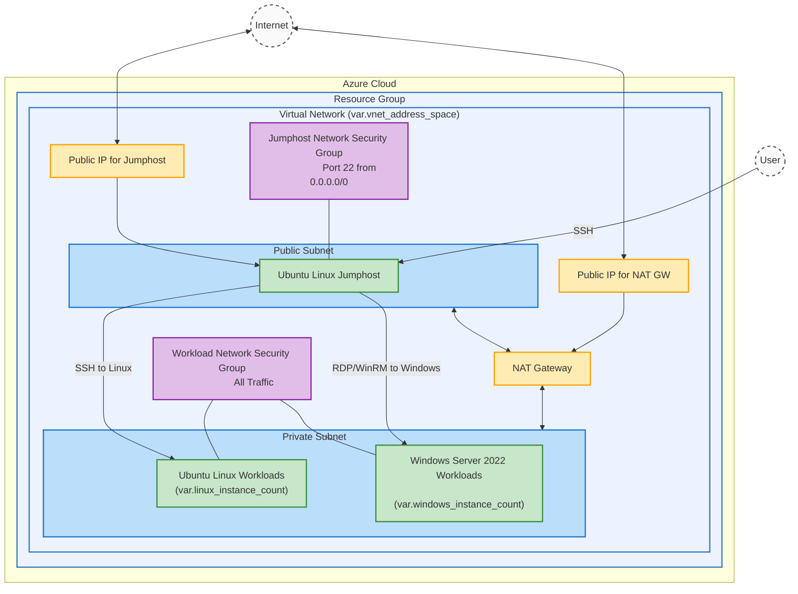

# Script to create a Lab environment in Azure automatically

## What is it?
This Terraform script will create a dedicated Lab environment in your Azure Subscription that consists of:
- a dedicated Virtual Network with a public and a private subnet (IP-Ranges can be defined)
- Internet connectivity for all elements, for private subnet via NAT Gateway
- an internet facing (Linux) Jumphost
- a (defined by variables) Number of Linux (Ubuntu) and Windows Instances

## How does it work?

### Prerequisites:
- git needs to be installed
- Azure CLI needs to be installed and properly configured for your Azure environment
- Terraform needs to be installed and properly configured
- Optionally Ansible needs to be installed and properly configured

## What to do?

- pull the repo
```
  git clone https://github.com/VolkerMarschner/azure_lab_env.git
```
- cd into directory azure_lab_env
```
  cd azure_lab_env
```
- edit the file variables.tf and adjust values according to your needs. At minimum you should edit the variable "prefix", which controls the naming of newly created resources, and "subscription_id" with your Azure subscription ID.
 
- Let Terraform do its magic by issuing the following commands
```
 terraform init
 terraform plan
 terraform apply
```
- After a successful run, you will find information about IPs, DNS Names, private SSH keys etc. in the same directory
- Important: Before you use the ssh keys (.pem files) first do a
```
chmod 400 ./*.pem
```
-after all is setup in Azure, things need to be configured. First, do a
```
ansible -i ./inventory jumphost -m ping
```
If that works, continue with
```
ansible-playbook -i inventory jumphost-setup.yml
```
Once that is successfully finished, the Jumphost should reboot automatically -if not, do it manually (ssh into it or do it from the Azure Portal).

Next Step is then
```
ansible -i ./inventory linux_workload -m ping
- it may be needed at first contact to go to each one individually, like
ansible -i ./inventory linux-wl-0 -m ping
ansible -i ./inventory linux-wl-1 -m ping
... and so on
```
Once that works, finish with
```
ansible-playbook -i inventory workload-setup.yml
```
and all should be set. Now you should have something like this:


    

## Key Features

### Security
- **Separate SSH Keys**: Jumphost and workload VMs use different SSH key pairs for enhanced security
- **Network Segmentation**: Public subnet for jumphost, private subnet for workloads
- **Security Hardening**: Automatic fail2ban installation and configuration on jumphost
- **Automatic Updates**: Unattended upgrades configured for security patches

### Authentication
- **Linux VMs**: SSH key-based authentication with separate keys for jumphost and workloads
- **Windows VMs**: Password-based authentication (password documented in Terraform outputs)

### Networking
- **SSH Proxy Jump**: Workload VMs accessible through jumphost using SSH proxy configuration
- **NAT Gateway**: Outbound internet access for private subnet VMs
- **Network Security Groups**: Tailored security rules for jumphost and workloads

### Automation
- **Ansible Integration**: Automatic inventory generation with proper proxy configuration
- **Configuration Management**: Jumphost hardening and workload setup through Ansible playbooks
- **Documentation**: Comprehensive output files with all connection details

## Windows VM Access

Windows VMs are accessible via:
- **Username**: As specified in variables.tf (default: azureuser)  
- **Password**: As specified in variables.tf and documented in vm-instance-data.txt
- **Connection**: RDP or WinRM through jumphost

The Windows admin password is also available as a Terraform output:
```
terraform output windows_admin_password
```

## File Structure

After deployment, you'll find these files:
- `*-JH-private-key.pem` - SSH private key for jumphost
- `*-WL-private-key.pem` - SSH private key for workload VMs
- `inventory` - Ansible inventory file with all VMs
- `vnet_data.txt` - Virtual network information
- `vm-instance-data.txt` - VM details including Windows passwords

## Once you do no longer need the environment, simply do a
```
  terraform destroy
```